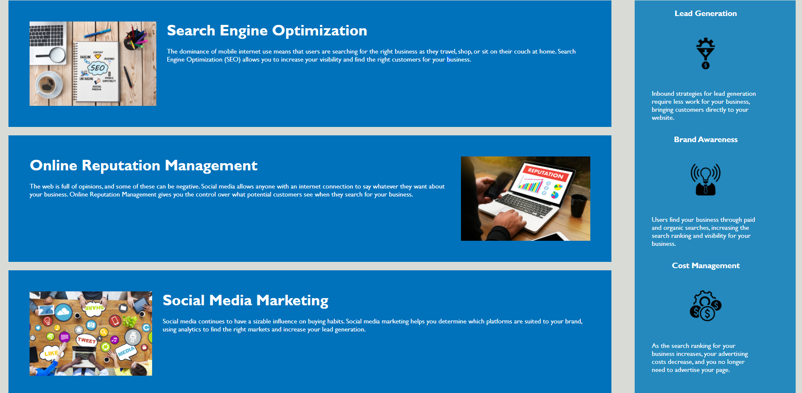

# marketing-accessibility

This site is a rework project meant to refactor a website for cleanliness, semantic CSS and HTML organization, and meeting accessibility standards.
Main changes to the site include changing tags to be more descriptive, consolidating CSS structures, and adding screen reader accessibility functionality.

Link to the application: https://old-prego.github.io/marketing-accessibility/#search-engine-optimization